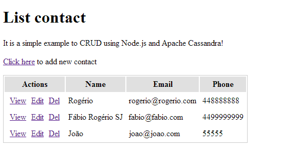

example-node-cassandra
======================

It is a simple example to CRUD using Node.js and Apache Cassandra!

## Dependencies

For this example I used `express` and the driver for Apache Cassandra `helenus`.

## Installation

You need to have installed node.js and Apacha Cassandra!
I'll create a Gits about installation and configured Apache Cassandra.

`git clone https://github.com/fabiorogeriosj/example-node-cassandra.git`

`npm install`

## Usage

Edit the file `app.js` and change the host connection to Cassandra `hosts : ['192.168.1.214:9160']`.

After...

`node app.js`

## Result 

Open your browser to link `http://localhost:8181/`

